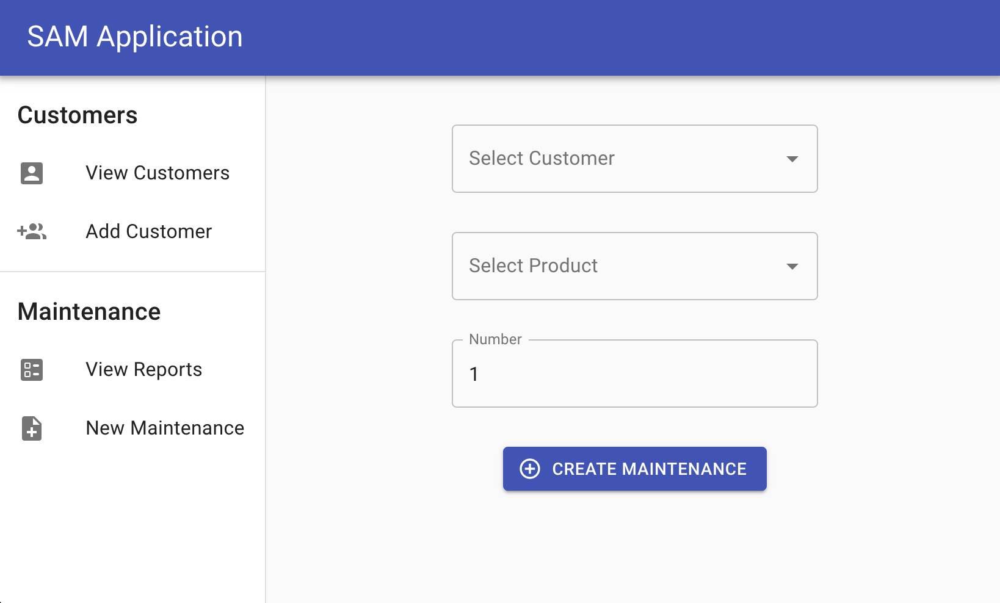

## SAM (Service And Maintenance) Reporting App.

A fullstack (web) application to document technical maintenance jobs and generate associated reports.

## Description

This is a project to provide an application for technical field service operatives or in-house service centers to generate and track maintenance reports. The current heavily used solution in the industry is Excel, which (in this authors view) has lost its practicality compared to todays available technologies.

This provides a modern solution that simplifies any and all tasks related to generating, tracking and distributing maintenance data and reports. Products, data templates and reports in this project serve as an example and can be customized.

## Installation

1. Clone this repo.
2. Run "npm -i" from the root directory and /frontend directory
3. Provide all required .env variable values
4. Seed your database with some dummy users running "node /backend/utils/seeder.js" from root
5. Run "npm run dev" from the root directory and visit "http://localhost:4200/"
6. Enter login credentials as provided with the seeder file: "admin@exmple.com" and "123456"

## Preview:

## Technologies:

- Frontend: Angular, Angular Material, TailwindCSS, Jest
- Backend: NodeJS, Express, Mongoose, MongoDB, Pdfkit

## Planned Features

Initially:

- [x] User (Engineer) can create and submit maintenance reports through forms.
- [x] User (Engineer) can search / review past maintenance reports.
- User (Engineer) can use previous maintenance data to pre-populate new maintenance reports.
- [x] User (Engineer) can request PDF reports from server.
- [x] User (All) has to log into application.
- User (Admin) can search / review all maintenance reports.

Potentially:

- User (Customer) can log into application and review/request his own maintenance data.

## Disclaimer

This is a personal project that is intended to see actual usage at some point but also provide a basis of learning different technologies.
